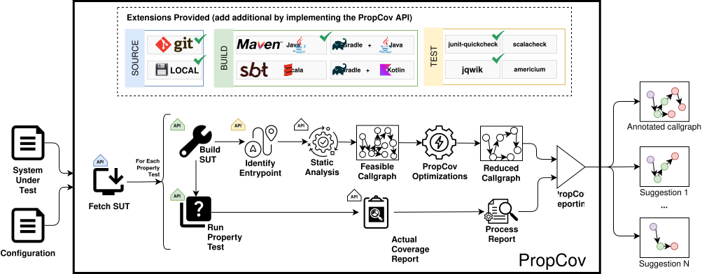

# PropCov

PropCov improves coverage reporting for property-based tests by identifying code that is reachable from each test.

## Overview

PropCov, short for **Prop**erty **Cov**erage, is a software testing analysis tool that improves coverage reporting for property-based tests. Traditional coverage tools report all uncovered code equally, even when portions of that code cannot be reached from a particular test. PropCov combines test execution data with static analysis to identify the code that is reachable from each property-based test, allowing developers to focus on feasible coverage opportunities and better understand the effectiveness of their tests.

## Contents

- [How It Works](#how-it-works)
- [Environment Prerequisites](#environment-prerequisites)
- [Building](#building)
- [Getting Started](#getting-started)
- [Running PropCov](#running-propcov)
- [Project YAML Configuration](#project-yaml-configuration)
- [PropCov Output Files](#propcov-output-files)
- [Extending PropCov](#extending-propcov)
- [Artifact](#artifact)
- [License](#license)

## Supported Integrations

| Category                | Built-in integrations   |
|-------------------------|-------------------------|
| Source                  | Local, Git              |
| Build system            | Maven, Gradle           |
| Property-test framework | junit-quickcheck, jqwik |
| Static analysis         | OPAL                    |
| Coverage                | JaCoCo                  |

## How It Works



## Environment Prerequisites

- Java 15+ JDK
- Maven
- Graphviz `dot` when `PropCov.BuildSVG=true` or when rendering DOT files manually
- Internet access for the initial Maven dependency download and Git-backed SUT retrieval
- Linux *(note: Windows and macOS may work, but are not thoroughly tested)*

## Building

PropCov uses Maven as its build system. Run the following command from the repository root to compile the modules, run the tests, and produce the executable JAR:

```bash
mvn package
```

A successful build ends with `BUILD SUCCESS`. The executable JAR is written to:

```text
runtime/target/propcov-runtime-0.1-SNAPSHOT-jar-with-dependencies.jar
```

### Build troubleshooting

If the build fails, check that:

- `java -version` reports JDK 15 or newer;
- `mvn -version` reports the expected Maven and Java installations;
- `JAVA_HOME` points to the JDK directory, not its `bin/java` executable; and
- Maven can access the configured dependency repositories.

For example, if Java is installed at `/usr/lib/jvm/java-21-openjdk-amd64/bin/java`, set:

```bash
export JAVA_HOME=/usr/lib/jvm/java-21-openjdk-amd64
```

## Getting Started

After building PropCov, run it against one of the included project configurations. Configurations are stored as `artifacts/configs/<project>/<project>.yaml`; the `runconfig` argument is the project directory name. The following example runs the `mph-table` configuration from start to finish.

```bash
java -jar runtime/target/propcov-runtime-0.1-SNAPSHOT-jar-with-dependencies.jar \
  runconfig mph-table
```

The output ends with messages similar to:

```text
[main] INFO edu.uic.bitslab.propcov.core.report.DeveloperReport - Coverage Summary Report Written to artifacts/executions/mph-table/20260804_143622/REPORTS/summary-mph-table.csv
[main] INFO Run - Elapsed time (s): 0.077996017
[main] INFO Run - Ended: Report
[main] INFO Run - Process completed
[main] INFO core.analyze.MetaData - Elapsed time (s): 84.560977924
[main] INFO core.analyze.MetaData - Ended: TOTAL
[main] INFO core.analyze.Artifact - Artifact elapsed time: 84.560977924
```

Reports and other artifacts are written beneath the timestamped directory shown in the `Coverage Summary Report` message.

## Running PropCov

PropCov can run from a reusable YAML project configuration or directly from JVM system properties. YAML configurations are recommended for repeatable analyses; manual mode is useful for one-off runs and configuration experiments.

PropCov syntax from the repository root is:

```text
java [OPTIONS] -jar runtime/target/propcov-runtime-0.1-SNAPSHOT-jar-with-dependencies.jar ACTION [ARGS]
```

`OPTIONS` is one or more JVM system properties in the form `-DName=Value`. These are primarily used in manual mode, although supported command-line properties override values from a project configuration.

| ACTION    | ARGS            | OPTIONS               |
|-----------|-----------------|-----------------------|
| genconfig | PATH_TO_SUT_JAR | _none_                |
| runconfig | PROJECT_NAME    | _see options section_ |
| runmanual | _none_          | _see options section_ |

### JVM System Properties

The current runtime consumes the following JVM system properties. Supply them before `-jar`, in the form `-DName=Value`. These values are overrides; they are not a flat equivalent of the nested project YAML structure.

| Property | Default | Effect |
| --- | --- | --- |
| `PropCov.Project` | CLI project name | Overrides the project name used in artifact paths and reports. |
| `PropCov.SubProject` | YAML value or empty | Overrides the configured subproject. |
| `PropCov.MainJar` | YAML value | Overrides every configured main-JAR value. |
| `PropCov.MainJarWithDependencies` | YAML value | Overrides every configured dependency-JAR value. |
| `PropCov.TestJar` | YAML value | Overrides every configured test-JAR value. |
| `PropCov.TestPropertyName` | none | Together with `TestPropertyEndpoint`, selects one configured property test. |
| `PropCov.TestPropertyEndpoint` | none | Full or uniquely matching partial JVM method signature. |
| `PropCov.TestPropertySubProject` | none | Subproject for a property selected through system properties. |
| `PropCov.PatchFile` | YAML value | Overrides the patch path. The patch is applied only when `Patch` is in the workflow. |
| `PropCov.ArtifactDirectory` | `artifacts` (`runconfig`) or `artifacts/manual/` (`runmanual`) | Base directory beneath which `executions/<project>/...` is created. |
| `PropCov.BuildSVG` | `false` | Produces SVG versions of generated DOT graphs using Graphviz. |
| `PropCov.TimeoutDefault` | `0` | Default timeout in seconds for every timeout category; `0` means no timeout. |
| `PropCov.Timeout.<type>` | inherited default | Overrides one timeout listed under [Timeout Properties](#timeout-properties). |
| `PropCov.Workflow` | all workflow enum values | Comma-separated workflow item names or lowercase shortcut names. |
| `PropCov.Source.ExtensionClass` | Local in manual mode | Selects the source extension in manual mode. |
| `PropCov.BuildSystem.ExtensionClass` | Maven | Selects the build-system extension in manual mode. |
| `PropCov.Coverage.ExtensionClass` | JaCoCo | Selects the coverage extension in manual mode. |
| `PropCov.TestFramework.ExtensionClass` | JunitQuickCheck | Selects the property-test-framework extension in manual mode. |
| `PropCov.AnalysisFramework.ExtensionClass` | Opal | Selects the analysis extension in manual mode. |
| `PropCov.Source.Local.Directory` | none | Local source directory used by the Local extension. |
| `PropCov.Source.Git.URL` | none | Git repository URL. |
| `PropCov.Source.Git.CacheDirectory` | `../propcov-cache` | Git clone-cache directory. |
| `PropCov.BuildSystem.Maven.LocalDirectory` | `../propcov-sut/<project>[/<subproject>]` | Maven working directory. |
| `PropCov.BuildSystem.Maven.TargetPath` | `<LocalDirectory>/target` | Maven build-output directory. |
| `PropCov.BuildSystem.Maven.Options` | empty | Extra options appended to the Maven test command. |
| `PropCov.Coverage.JaCoCo.XMLCoverageReport` | `site/jacoco/jacoco.xml` | JaCoCo XML report path relative to the selected build target. |
| `PropCov.AnalysisFramework.Opal.OPALLoggerType` | `warn` | OPAL log level. |
| `PropCov.AnalysisFramework.Opal.AnalysisFlags` | `EXCEPTION,ITERATOR` | Comma-separated `AnalysisFlag` enum values. |
| `PropCov.AnalysisFramework.Opal.AnalysisType` | `RTA` | `AnalysisType` enum value used by OPAL. |

Graph colors can be overridden with `PropCov.PathImprovementColorFirst`, `PropCov.PathImprovementColorSecond`, and `PropCov.PathImprovementColorThird`, plus the `PropCov.NodeColor*` properties defined in `core-defined-properties.yaml`.

`PropCov.OutputPath`, `PropCov.PackageName`, and `PropCov.PackageNames` are stored in `Config`, but current execution and reporting code does not use them to choose the artifact directory or restrict analysis. `PropCov.LocalDirectory` and `PropCov.TargetPath` are legacy names checked by manual-mode validation; the active extensions use the source/build-system-specific properties shown above.

### Generate a Project Configuration

The `genconfig` action examines a test JAR, locates property tests, and writes a starter configuration to standard output or a file. The generated configuration uses the Local, Maven, and JaCoCo extensions and contains placeholder values that must be adapted to the target environment.

#### Output YAML to screen

Generate a YAML configuration containing all detected property-test entry points. Complete or remove placeholder values before running it.

The first argument is the path to the test JAR to examine.

```bash
java \
  -jar runtime/target/propcov-runtime-0.1-SNAPSHOT-jar-with-dependencies.jar \
  genconfig sut/new-project/target/tests.jar
```

#### Save YAML to file

The first argument is the test JAR to examine. The second is the destination YAML file. PropCov does not overwrite an existing destination.

```bash
java \
  -jar runtime/target/propcov-runtime-0.1-SNAPSHOT-jar-with-dependencies.jar \
  genconfig sut/new-project/target/tests.jar ~/new-project.yaml
```

#### Current Generator Defaults

`genconfig` currently fixes the source, build, and coverage extensions to Local, Maven, and JaCoCo. It uses OPAL and JunitQuickCheck when discovering property methods. The implementation contains lookups intended to make the project name, analysis framework, and test framework configurable, but those lookup names are not registered correctly, so command-line overrides for them are not currently effective.

## Project YAML Configuration

### Format

| Name                    | Description                                                                                          |
|-------------------------|------------------------------------------------------------------------------------------------------|
| version                 | Version number for this YAML file                                                                    |
| name                    | Descriptive configuration name; artifact naming normally comes from the `runconfig` argument         |
| subProject              | Optional project-level subproject                                                                    |
| patchName               | Patch file passed to the `Patch` workflow step                                                       |
| mainJar                 | Main SUT JAR path, as a string or list                                                               |
| mainJarWithDependencies | SUT JAR-with-dependencies path, as a string or list                                                   |
| testJar                 | Test JAR path, as a string or list                                                                   |
| timeouts                | Map of timeout type to duration in seconds. See the table [Timeout Properties](#timeout-properties). |
| source                  | Contains configuration details on source for retrieving SUT (e.g. Local or Git)                      |
| > extensionClass        | Class name (or alias) for the source extension class                                                 |
| > properties            | Contains properties for configuring source extension class (varies by class)                         |
| >> checkoutID           | Git commit, tag, or branch to check out                                                              |
| >> URL                  | Git repository URL                                                                                   |
| buildSystem             | Contains configuration details on build system for SUT (e.g. Maven)                                  |
| > extensionClass        | Class name (or alias) for the build system extension class                                           |
| > properties            | Contains properties for configuring build system extension class (varies by class)                   |
| >> Options              | For Maven: options to pass to the test runner (e.g. `-DfailIfNoTests=false`)                         |
| > env                   | Environment variables added to Maven or Gradle subprocesses                                          |
| testFramework           | Contains configuration details on test framework for SUT (e.g. JUnitQuickCheck)                      |
| > extensionClass        | Class name (or alias) for the test framework extension class                                         |
| > properties            | Contains properties for configuring test framework extension class (varies by class)                 |
| analysisFramework       | Contains configuration details on analysis framework to be used (e.g. OPAL)                          |
| > extensionClass        | Class name (or alias) for the analysis framework extension                                           |
| > properties            | Contains properties for configuring analysis framework extension class (varies by class)             |
| coverage                | Contains configuration detail on coverage for SUT (e.g. JaCoCo)                                      |
| > extensionClass        | Class name (or alias) for the coverage extension                                                     |
| > properties            | Contains properties for configuring coverage extension class (varies by class)                       |
| packageNames            | Optional list stored in `Config`; not currently used to restrict analysis                            |
| properties              | Array of test endpoints to run for this SUT                                                          |
| [> name                 | Name of entrypoint (e.g. Class#TestMethod)                                                           | 
| [> entryPoint           | Full JVM name of the class/method/parameters/return to run                                           |
| [> subProject           | Optional build subproject containing this property test                                              |

Each extension node is represented internally with separate `properties` and `env` maps. The `properties` map contains settings interpreted by the extension implementation, such as Maven's `Options` or Git's `URL`. Although the YAML model can deserialize an `env` map for any extension, the current built-in implementations consume it only for `buildSystem`, where its entries become operating-system environment variables for Maven or Gradle subprocesses. For example, `JAVA_HOME` belongs under `buildSystem.env`, not `buildSystem.properties`. PropCov also supplies the `OverrideNumOfTrials` build environment variable when it is absent.

Relative JAR paths beginning with `./` are resolved from the source directory. Other relative JAR paths are resolved from the build system's target directory. Absolute paths are used unchanged.


### Example

```yaml

version: 1
name: mph-table
source:
  extensionClass: edu.uic.bitslab.propcov.extensions.source.Git
  properties:
    checkoutID: dbd5413df33bf8f0a995822eeefe94df50f3c5a7
    URL: https://github.com/indeedeng/mph-table.git
patchName: artifacts/configs/mph-table/mph-table.patch
mainJar: mph-table-1.0.6-SNAPSHOT.jar
mainJarWithDependencies: mph-table-1.0.6-SNAPSHOT-jar-with-dependencies.jar
testJar: mph-table-1.0.6-SNAPSHOT-tests.jar
buildSystem:
  extensionClass: edu.uic.bitslab.propcov.extensions.buildsystem.Maven
  properties:
    Options: -DfailIfNoTests=false
  env:
    JAVA_HOME: /usr/lib/jvm/java-11-openjdk
testFramework:
  extensionClass: edu.uic.bitslab.propcov.extensions.testframework.JunitQuickCheck
analysisFramework:
  extensionClass: edu.uic.bitslab.propcov.extensions.analysisframework.Opal
coverage:
  extensionClass: edu.uic.bitslab.propcov.extensions.coverage.JaCoCo
properties:
  - name: TestSmartListSerializer#canRoundTripSerializableLists
    entryPoint: com.indeed.mph.serializers.TestSmartListSerializer.canRoundTripSerializableLists(Ljava/util/List;Ljava/util/List;Ljava/util/List;)V
  - name: TestSmartShortSerializer#canRoundTripShort
    entryPoint: com.indeed.mph.serializers.TestSmartShortSerializer.canRoundTripShort(S)V
  - name: TestSmartIntegerSerializer#canRoundTripIntegers
    entryPoint: com.indeed.mph.serializers.TestSmartIntegerSerializer.canRoundTripIntegers(I)V
  - name: TestSmartStringSerializer#canRoundTripStrings
    entryPoint: com.indeed.mph.serializers.TestSmartStringSerializer.canRoundTripStrings(Ljava/lang/String;)V
  - name: TestSmartByteSerializer#canRoundTripBytes
    entryPoint: com.indeed.mph.serializers.TestSmartByteSerializer.canRoundTripBytes(B)V
  - name: TestSmartLongSerializer#canRoundTripLongs
    entryPoint: com.indeed.mph.serializers.TestSmartLongSerializer.canRoundTripLongs(J)V
  - name: TestSmartPairSerializer#canRoundTripPairs
    entryPoint: com.indeed.mph.serializers.TestSmartPairSerializer.canRoundTripPairs(Lcom/indeed/util/core/Pair;)V
  - name: TestSmartOptionalSerializer#canRoundTripPresentOptionals
    entryPoint: com.indeed.mph.serializers.TestSmartOptionalSerializer.canRoundTripPresentOptionals(J)V

```

## Run from a YAML Configuration

Pass the project configuration's directory name as the first argument. For example, `mph-table` loads `artifacts/configs/mph-table/mph-table.yaml`.

```bash
java \
  -jar runtime/target/propcov-runtime-0.1-SNAPSHOT-jar-with-dependencies.jar \
  runconfig mph-table
```

| JVM system property | Default | Description |
| --- | --- | --- |
| `PropCov.Workflow` | All `WorkflowItem` values | See [Workflow Steps](#workflow-steps). |

### Shortcut Workflow Macro
*(recommended to use)*

| Shortcut Workflow Items | Steps Included                                            |
|-------------------------|-----------------------------------------------------------|
| fetch                   | Remove,Download,Patch                                     |
| git                     | *alias of fetch*                                          |
| build                   | RunBuild                                                  |
| test                    | BuildCallGraph,RunPropertyCoverage,ApplyCoverage,Analysis |

### Workflow Steps

| Workflow Item       | Description                                                                   |
|---------------------|-------------------------------------------------------------------------------|
| Remove              | Removes project from SUT directory. Does not affect artifacts previously ran. |
| Download            | Downloads from the specified location (e.g. Git)                              |
| Patch               | Apply the patch file to the SUT.                                              |
| RunBuild            | Build the project using the specified build system (e.g. Maven)               |
| BuildCallGraph      | Use the configured analysis framework to generate a call graph.               |
| RunPropertyCoverage | Run property tests to collect coverage information.                           |
| ApplyCoverage       | Apply the coverage information to the call graph (e.g. color nodes)           |
| Prune               | Accepted by configuration, but currently has no runtime execution branch.     |
| Analysis            | Calculate heuristic scores and write heuristic artifacts.                     |

With no `PropCov.Workflow` override, `runconfig` starts with every `WorkflowItem`, including `Remove`, `Download`, `Patch`, and the currently inert `Prune` item. Manual mode explicitly removes `Remove`, `Download`, and `Patch`. Names are case-sensitive: full workflow items use the capitalization shown above, while shortcut names are lowercase.

### Timeout Properties

All properties below must be prefixed with `PropCov.Timeout.`; the prefix is omitted from the table for conciseness.

| Property        | Description                                                                       |
|-----------------|-----------------------------------------------------------------------------------|
| patchSUT        | Run Patch Step                                                                    |
| cleanSUT        | Build System Clean Step                                                           |
| buildSUT        | Build System Build Step                                                           |
| testPropertySUT | Build System Test Property Step. This applies to each property test individually. |
| dotGeneration   | Generate graph SVG from DOT file                                                  |
| buildCallgraph  | Build the static call graph for a property-test entry point                       |

## Manual SUT Run

Manual mode accepts JVM system properties. The following example includes the required and recommended options.

```bash
java \
  -DPropCov.LocalDirectory=/path/to/sut \
  -DPropCov.Source.Local.Directory=/path/to/sut \
  -DPropCov.TargetPath=target \
  -DPropCov.BuildSystem.Maven.TargetPath=/path/to/sut/target \
  -DPropCov.MainJar=main.jar \
  -DPropCov.TestJar=test.jar \
  -DPropCov.MainJarsWithDependencies=main-with-dependencies.jar \
  -DPropCov.MainJarWithDependencies=main-with-dependencies.jar \
  '-DPropCov.TestPropertyEndpoint=com.project.TestMe.canRoundTrip(Ljava/util/List;)V' \
  -jar runtime/target/propcov-runtime-0.1-SNAPSHOT-jar-with-dependencies.jar \
  runmanual
```

> **Known limitation:** manual-mode validation checks the legacy `PropCov.LocalDirectory`, `PropCov.TargetPath`, and plural `PropCov.MainJarsWithDependencies` names. Construction uses `PropCov.Source.Local.Directory`, the selected build extension's target-path property, and singular `PropCov.MainJarWithDependencies`. Until the runtime is corrected, manual runs must set both forms, as shown above. The example assumes the default Local, Maven, JaCoCo, JunitQuickCheck, and Opal extensions.


## PropCov Output Files

PropCov creates an artifact directory for each run at `ArtifactDirectory/executions/<project>[/<subproject>]/<yyyyMMdd_HHmmss>/`. With `runconfig` defaults, `ArtifactDirectory` is `artifacts`. The output contains copied runtime JARs, per-property-test data, and project-level reports.

The exact files depend on the workflow, extensions, OPAL flags, build system, and `PropCov.BuildSVG`. A complete Maven/JaCoCo/OPAL run typically has this structure:

```text
<timestamp>/
├── REPORTS/
│   ├── config.yaml
│   ├── metadata.json
│   ├── coverage_details.json
│   ├── coverage_details.ser
│   ├── summary-<project>.csv
│   ├── detail-<property-test>.csv
│   ├── IteratorOptimization-<property-test>.json
│   └── ThrowOptimization-<property-test>.json
│
├── RUNTIME/
│   ├── <application>.jar
│   ├── <application>-jar-with-dependencies.jar
│   └── <application>-tests.jar
│
└── TESTS/
    └── <property-test>/
        ├── callgraph.dot
        ├── callgraph.svg
        ├── coverage.dot
        ├── coverage.svg
        ├── heuristic.dot
        ├── heuristic.svg
        ├── coverage.ser
        ├── heuristicNodeData.ser
        ├── missingNodesPropCov.csv
        ├── jacoco.exec
        ├── TEST-<test-class>.xml
        ├── <test-class>.txt
        ├── <timestamp>.dumpstream
        └── jacoco/
            ├── index.html
            ├── jacoco.xml
            ├── jacoco.csv
            ├── jacoco-resources/
            └── <package>/
                └── ...
```

The three SVG files are present only when `PropCov.BuildSVG=true`. The OPAL optimization reports are present only when their corresponding `EXCEPTION` or `ITERATOR` analysis flags are enabled. JaCoCo and Surefire files are specific to the built-in coverage and Maven integrations.

### Top-Level Directories

#### `REPORTS/`

Contains project-level reports and aggregated results generated after the individual property tests have been analyzed.

These files are generally the most useful output for processing PropCov results programmatically or comparing results across projects.

#### `RUNTIME/`

Contains the compiled application artifacts used during the PropCov run.

For a Maven project, for example, this can include the project's main JAR, test JAR, and a JAR containing dependencies. The exact files depend on the build configuration for the system under test.

These files preserve the runtime artifacts against which the analysis was performed.

#### `TESTS/`

Contains the complete analysis output for each individual property test.

Each property test receives its own directory. The directory name is based on the fully qualified JVM method signature of the property-test entry point, for example:

```text
com.indeed.mph.serializers.TestSmartIntegerSerializer.canRoundTripIntegers(I)V/
```

Because JVM method descriptors are used, parameter and return types appear in their JVM descriptor form.

### `REPORTS/` Files

#### `config.yaml`

The serialized project configuration. For `runconfig`, this is the originally loaded YAML object and therefore does not reflect JVM system-property overrides. Manual and generated configurations are synthesized from the constructed `Config`. Consult `metadata.json` and the invocation alongside this file when reproducing an overridden run.

#### `metadata.json`

Run metadata and execution statistics.

This includes timing information for the overall analysis and individual property tests. Depending on the run, it can also contain information such as:

* expected property-test trials;
* number of trials actually executed;
* elapsed analysis time;
* time spent building the call graph;
* time spent collecting and applying coverage;
* whether the property test completed with an error; and
* error information when applicable.

This file is useful for analyzing PropCov performance and detecting incomplete or failed analyses.

#### `summary-<project>.csv`

Project-level summary of the analyzed property tests.

There is one row for each test directory that contains both `coverage.ser` and `heuristicNodeData.ser`. `Score` is the heuristic method score of the graph entry point. The line columns aggregate nodes whose type begins with `COVERAGE`.

For example, a summary can contain columns similar to:

```text
Test,Score,TotalLinesCovered,TotalLines,CoveredPercentage
```

This file is generally the starting point when comparing property tests within a project or collecting results across multiple projects.

#### `detail-<property-test>.csv`

Detailed method-level results for a single property test.

Each row represents a node in the colored call graph and has these exact columns:

```text
Method,Color,Type,Score,LinesMissed,LinesCovered,TotalLines,CoveredPercentage
```

The report exposes the data represented graphically in the PropCov graph files in a format that is easier to process using scripts, spreadsheets, or statistical tools.

The `Type` and `Color` fields describe the classification assigned to the node during the PropCov analysis.

#### `coverage_details.json`

Detailed coverage information for all analyzed property tests.

Coverage information is keyed first by property-test entry point and then by `Coverage` (the external coverage tool) or `PropCov`. Each contains per-method `CoverageDetail` values with method, branch, and line counts plus covered and missed source-line sets.

This file is intended for programmatic inspection when more detail is required than is available in the summary or per-property CSV files.

#### `coverage_details.ser`

Java-serialized representation of the detailed coverage information.

This is primarily an internal PropCov artifact. `coverage_details.json` should normally be preferred when the results need to be inspected or processed outside PropCov.

#### `IteratorOptimization-<property-test>.json`

Results associated with PropCov's iterator optimization analysis for the specified property test.

Written only when the OPAL `ITERATOR` flag is enabled. The file records `Property`, a string-valued `Count`, and `Nodes/Edges`. An empty array means no nodes were removed.

#### `ThrowOptimization-<property-test>.json`

Results associated with PropCov's throw optimization analysis for the specified property test.

Written only when the OPAL `EXCEPTION` flag is enabled. It has the same fields as the iterator report, with `Nodes/Edges` containing removed edges.

### `RUNTIME/` Files

The `RUNTIME` directory contains application binaries used for the analysis.

For the `mph-table` example, these include:

```text
mph-table-1.0.6-SNAPSHOT.jar
mph-table-1.0.6-SNAPSHOT-jar-with-dependencies.jar
mph-table-1.0.6-SNAPSHOT-tests.jar
```

The precise names and number of artifacts depend on the system under test and its PropCov configuration.

These artifacts are retained so that the binaries associated with a particular result set can be identified independently of later changes to the project's build directory.

### Per-Test Output

Each directory under `TESTS/` corresponds to one property-test entry point.

#### `callgraph.dot`

The raw call graph constructed for the property test.

Nodes represent methods and directed edges represent possible calls between methods. This graph represents the structural call graph before PropCov coverage and heuristic information are applied.

The file uses the Graphviz DOT format and can be rendered with Graphviz for visual inspection.

#### `coverage.dot`

The call graph annotated with PropCov coverage classifications.

The graph retains the method relationships from the call graph while using node attributes, including colors, to show the coverage-related classifications assigned during the analysis.

This is generally the most useful graph for visually examining how observed property-test execution relates to the statically reachable call graph.

#### `heuristic.dot`

The call graph annotated with PropCov heuristic data.

In addition to the graph structure and node classifications, node labels include information used by the PropCov heuristic, such as:

```text
missed
depth
scoreMethod
scoreLOC
scoreOverall
```

This graph is useful for investigating how PropCov arrived at its prioritization or score for individual methods.

#### `coverage.ser`

Java-serialized coverage-analysis data for the property test.

This is an internal PropCov representation primarily intended for use by PropCov itself rather than direct inspection.

#### `heuristicNodeData.ser`

Java-serialized heuristic information associated with nodes in the property-test call graph.

As with the other `.ser` files, this is primarily an internal artifact used to preserve intermediate PropCov analysis results.

#### `missingNodesPropCov.csv`

Lists methods for which coverage-related information could not be matched to a node in the PropCov analysis.

Each line identifies a JVM method signature, for example:

```text
com.example.Example.<clinit>()V
```

This file is primarily useful when diagnosing differences between the static call graph and runtime coverage information.

#### `jacoco.exec`

The raw JaCoCo execution data collected while running the property test.

This binary file can be consumed by JaCoCo tooling to regenerate or further analyze runtime coverage information.

#### `jacoco/`

The standard JaCoCo report generated for the property test.

Important files include:

* `index.html` — entry point for the interactive HTML coverage report.
* `jacoco.xml` — machine-readable XML coverage report.
* `jacoco.csv` — coverage information in CSV format.
* `jacoco-resources/` — images and other resources used by the HTML report.
* package directories — class- and source-level HTML coverage reports.

Opening `jacoco/index.html` in a web browser provides the standard JaCoCo coverage view for that individual property test.

#### `TEST-<test-class>.xml`

JUnit/Surefire-style XML test report generated while executing the selected property test.

It contains structured information about the test invocation, including execution status and failures when applicable.

#### `<test-class>.txt`

Text output associated with the test execution.

The exact contents depend on the build and test framework and are primarily useful when diagnosing a property-test execution problem.

#### `<timestamp>.dumpstream`

A Maven Surefire dump-stream file that may be produced during test execution.

This is normally only of interest when diagnosing unusual test-runner output or failures.

### Rendering DOT Graphs

PropCov's `callgraph.dot`, `coverage.dot`, and `heuristic.dot` files use the [Graphviz](https://graphviz.org/) DOT graph-description format.

If Graphviz is installed, a DOT file can be converted to SVG using:

```bash
dot -Tsvg coverage.dot -o coverage.svg
```

The same command can be used for any PropCov graph:

```bash
dot -Tsvg callgraph.dot -o callgraph.svg
dot -Tsvg coverage.dot -o coverage.svg
dot -Tsvg heuristic.dot -o heuristic.svg
```

The general form of the command is:

```bash
dot -Tsvg <input.dot> -o <output.svg>
```

SVG is useful for PropCov graphs because it remains readable when zooming into large call graphs and can be opened directly by most modern web browsers.

For example:

```bash
dot -Tsvg TESTS/<property-test>/heuristic.dot \
    -o heuristic.svg
```

Graphviz can also generate other formats by changing the output type. For example:

```bash
dot -Tpng coverage.dot -o coverage.png
dot -Tpdf coverage.dot -o coverage.pdf
```

For documentation and interactive viewing, SVG is generally preferred because the output is vector-based and scales without loss of quality.

## Extending PropCov

PropCov supports five kinds of extensions:

| Extension type     | Base class                  | Responsibility                                                      |
|--------------------|-----------------------------|---------------------------------------------------------------------|
| Source             | `AbstractSource`            | Make the system-under-test (SUT) source available locally.          |
| Build system       | `AbstractBuildSystem`       | Clean and build the SUT, run one property, and locate build output. |
| Test framework     | `AbstractTestFramework`     | Recognize property-test methods in bytecode.                        |
| Analysis framework | `AbstractAnalysisFramework` | Discover properties and construct a call graph.                     |
| Coverage           | `AbstractCoverage`          | Read coverage output and apply it to PropCov's call graph.          |

An extension consists of an implementation class, a setup bridge that creates it, and, when the extension has configurable Java properties, a property-definition resource. The implementation and bridge must be present on PropCov's runtime classpath.

### Extension Lifecycle

At startup, `AbstractSetup.load()` uses ClassGraph to find every concrete subclass of `AbstractSetup`. It constructs each setup with a public no-argument constructor and calls `init()`. A setup registers itself in `AbstractSetup.bridges`.

When a project configuration is loaded, PropCov asks each registered bridge for the configured source, build system, test framework, analysis framework, and coverage implementation. A bridge returns a new instance when it recognizes `extension.extensionClass`, or `null` when it does not. PropCov uses the first non-null result.

Extension configuration has this common YAML shape:

```yaml
source: # or buildSystem, testFramework, analysisFramework, coverage
  extensionClass: AcmeSource
  properties:
    Endpoint: https://example.invalid/project
  env:
    TOKEN_NAME: value
```

During `runconfig` and `runmanual`, `extensionClass` is an identifier passed to the setup bridges, not a class that the configuration builder reflectively constructs. A bridge must explicitly map every supported short or fully qualified name to a constructor. `genconfig` is an exception: after configuring its bridges, it also reflectively constructs its selected analysis and test-framework classes by fully qualified name.

### Common Implementation Steps

1. Add the implementation class under the appropriate package. In-tree extensions normally belong in `extensions/src/main/java/edu/uic/bitslab/propcov/extensions/<type>/`.
2. Extend the corresponding abstract class and call its constructor with a unique Java-property prefix, such as `PropCov.Source.Acme.`.
3. Implement every abstract method as `public`.
4. Add the implementation to a setup bridge. For the built-in module, update `extensions/src/main/java/edu/uic/bitslab/propcov/extensions/Setup.java`.
5. If the extension has configurable properties, declare them in a classpath YAML resource and load that resource from the setup's `init()` method.
6. Add unit tests and at least one project configuration that selects the extension.
7. Run `mvn package` from the repository root.

The existing classes in the `extensions` module are useful reference implementations: `Local` and `Git`, `Maven` and `Gradle`, `JunitQuickCheck` and `JQwik`, `Opal`, and `JaCoCo`.

### Registering Extensions

The built-in setup uses a switch for each extension category. Follow the same pattern for a new implementation:

```java
@Override
public AbstractSource getSource(YAMLConfig.Extension extension, String projectName)
        throws SourceException {
    return switch (extension.extensionClass) {
        case "AcmeSource", "com.acme.propcov.AcmeSource" ->
                new AcmeSource(extension, projectName);
        default -> null;
    };
}
```

Return `null` for names owned by another bridge. Do not throw merely because the requested name is unknown to your setup.

For a separate extension JAR, provide your own concrete `AbstractSetup`:

```java
public final class AcmeSetup extends AbstractSetup {
    private static boolean initialized;

    public AcmeSetup() {}

    @Override
    protected void init() {
        if (initialized) return;
        Props.readProperties("acme-propcov-properties.yaml");
        AbstractSetup.bridges.add(this);
        initialized = true;
    }

    // Implement all five factory methods. Return null for unsupported types.
}
```

Package that JAR and its dependencies on the runtime classpath. A JAR added only to the SUT's dependencies is not visible to PropCov's extension scanner.

### Defining Properties

`AbstractExtension` copies registered properties matching the constructor prefix into `extension.properties`. Resolution precedence is:

1. a JVM `-D` system property;
2. the value in the project YAML (or a previously shared value);
3. the property definition's default.

A property-definition resource looks like this:

```yaml
packageName: com.acme.propcov
description: Acme PropCov extension properties
applyOrder: 3
props:
  - name: "PropCov.Source.Acme.Endpoint"
    defaultValue: "null"
    description: "Repository endpoint."
  - name: "PropCov.Source.Acme.CacheDirectory"
    defaultValue: "../propcov-cache"
    description: "Local cache directory."
```

The part after the final dot becomes the key in `extension.properties`; for example, `PropCov.Source.Acme.Endpoint` becomes `Endpoint`. A literal `"null"` default is converted to Java `null`. Direct YAML keys remain available even when they have no property definition. Any full property name passed through `Props.resolve*`, however, must be registered or resolution throws `RuntimeException: Unknown property`.

Use a resource filename unique to the extension JAR, place it under `src/main/resources`, and call `Props.readProperties("that-name.yaml")` during setup initialization. `applyOrder` controls merge order; later definitions with the same full property name replace earlier ones.

### Source Extensions

Extend `edu.uic.bitslab.propcov.core.source.AbstractSource` when the SUT must be obtained from a new location or protocol.

```java
public final class AcmeSource extends AbstractSource {
    public AcmeSource(YAMLConfig.Extension extension, String projectName) {
        super(extension, projectName, "PropCov.Source.Acme.");
    }

    @Override
    public void get() throws SourceException {
        // Populate localDirectory with the SUT source.
    }
}
```

Contract:

- `get()` must leave the source tree in `localDirectory` or throw `SourceException`.
- The inherited constructor reads the `Directory` property. If absent, it defaults to `../propcov-sut/<projectName>`.
- The inherited `localRemove()` recursively removes `localDirectory`; ensure the configured directory is narrowly scoped to the checked-out SUT.
- Validate required URLs, credentials, revisions, and paths during construction or `get()`, and wrap provider-specific failures in `SourceException`.

Select it with:

```yaml
source:
  extensionClass: AcmeSource
  properties:
    Directory: ../propcov-sut/example
    Endpoint: https://example.invalid/project
```

### Build-System Extensions

Extend `edu.uic.bitslab.propcov.core.buildsystem.AbstractBuildSystem` to support another build/test runner.

```java
public final class AcmeBuild extends AbstractBuildSystem {
    public AcmeBuild(YAMLConfig.Extension extension,
                     Map<Config.TimeoutType, Long> timeouts,
                     String projectName,
                     String subProjectName) {
        super(extension, timeouts, projectName, subProjectName,
              "PropCov.BuildSystem.Acme.");
    }

    @Override public void clean() throws TimerException, IOException,
            ExternalProcessException, InterruptedException { /* ... */ }

    @Override public void build() throws BuildSystemException, TimerException,
            IOException, ExternalProcessException, InterruptedException { /* ... */ }

    @Override public ExternalProcess.Result testProperty(
            Config config, PropertyTest propertyTest)
            throws IOException, TimerException, ExternalProcessException,
                   InterruptedException { /* ... */ }
}
```

Contract:

- `clean()` removes outputs from previous builds.
- `build()` must run the build that produces the main, dependency, and test JARs named by the project configuration.
- `testProperty()` runs only the supplied `PropertyTest`. It should reset old coverage first and leave the new coverage result where the coverage extension expects it.
- Use the appropriate entries from `timeouts` for external operations. The available workflow timeout keys are defined by `Config.TimeoutType`.
- Use `ExternalProcess` for subprocesses so working directories, environment variables, exit results, and timeouts behave consistently.
- `localDirectory`, `env`, `buildSystemType`, and `timeouts` are initialized by the base class.
- Override `getFullTargetPath(PropertyTest)` if the build output is not `<localDirectory>/target` or has special subproject rules.

Before constructing the build extension, the builder adds the source location under the extension property key `LocalFile` (including the project-level subproject when present). Build-specific YAML `env` entries are exposed through the inherited `env` map and are passed to `ExternalProcess` by the built-in Maven and Gradle implementations. The current JVM environment-override path in `AbstractBuildSystem` has an off-by-one key-extraction defect, so YAML `env` is the reliable configuration mechanism.

### Test-Framework Extensions

Extend `edu.uic.bitslab.propcov.core.testframework.AbstractTestFramework` to teach PropCov how to recognize a framework's property methods.

```java
public final class AcmeProperties extends AbstractTestFramework {
    public AcmeProperties(YAMLConfig.Extension extension) {
        super(extension, "PropCov.TestFramework.Acme.");
    }

    @Override
    public Boolean isTestProperty(org.opalj.br.Method method) {
        if (method == null) return false;
        return method.annotations().exists(annotation ->
                annotation.annotationType().asClassType().fqn()
                        .equals("com/acme/testing/Property"));
    }
}
```

`isTestProperty()` receives an OPAL bytecode method, not a reflection `Method`. Return `true` only for methods that PropCov should treat as property entry points. Annotation names in OPAL are JVM internal names and commonly use `/` separators; verify the representation used by the target framework. Handle missing annotations and malformed metadata without matching unrelated methods.

### Analysis-Framework Extensions

Extend `edu.uic.bitslab.propcov.core.analysisframework.AbstractAnalysisFramework` to integrate a static-analysis engine.

```java
public final class AcmeAnalysis extends AbstractAnalysisFramework {
    public AcmeAnalysis(YAMLConfig.Extension extension) {
        super(extension, "PropCov.AnalysisFramework.Acme.");
    }

    @Override
    public Graph<String, DefaultEdge> BuildCallGraph(
            Config config, PropertyTest propertyTest)
            throws AnalysisFrameworkException {
        // Build a directed graph rooted at propertyTest.entryPoint.
    }

    @Override
    public List<Tuple2<String, String>> GetProperties(
            InputStream classFile, AbstractTestFramework testFramework) {
        // Return (display name, JVM entry-point signature) pairs.
    }
}
```

Contract:

- `BuildCallGraph()` returns a JGraphT `Graph<String, DefaultEdge>` for the requested property. Node names must use the same identifiers consumed by coverage and reporting.
- `GetProperties()` examines the supplied class-file stream and delegates the final property decision to `testFramework.isTestProperty()`. PropCov calls it once for each `.class` entry in a test JAR.
- Property tuples contain a human-readable name and the full JVM method signature used as the entry point.
- Convert engine-specific failures into `AnalysisFrameworkException` with enough context to identify the property and input artifact.
- The base constructor requires an `AnalysisType` property. It optionally reads comma-separated, case-sensitive `AnalysisFlags`; values must match `AnalysisConfig.AnalysisType` and `AnalysisConfig.AnalysisFlag` enum constants.
- Use `PARAM_NOT_FOUND` when a parameter type cannot be resolved and that sentinel is appropriate to the analysis representation.

### Coverage Extensions

Extend `edu.uic.bitslab.propcov.core.coverage.AbstractCoverage` to consume another coverage format or engine.

```java
public final class AcmeCoverage extends AbstractCoverage {
    public AcmeCoverage(YAMLConfig.Extension extension) {
        super(extension, "PropCov.Coverage.Acme.");
    }

    @Override public void reset(Path target) throws IOException { /* ... */ }
    @Override public Path[] getResultPaths(Path start) { /* ... */ }
    @Override public void apply(Graph<String, DefaultEdge> graph,
            Config config, PropertyTest property) throws CoverageException { /* ... */ }
    @Override public void buildLOC(byte[] classBytes,
            Map<String, LOCTracker.LOCDetail> locs,
            Map<String, String> inheritance) { /* ... */ }

    @Override public Map<String, CoverageDetail> getOtherStatistics() { /* ... */ }
    @Override public Map<String, CoverageDetail> getPropCovStatistics() { /* ... */ }
    @Override public Set<String> getMissingNodesPropCov() { /* ... */ }
    @Override public CoverageDetail getOtherStatistics(String name) { /* ... */ }
    @Override public CoverageDetail getPropCovStatistics(String name) { /* ... */ }
}
```

Contract:

- `reset()` removes or clears the prior run's coverage data for the target.
- `getResultPaths()` returns candidate result files or directories rooted at the supplied path. Artifact copying silently ignores candidates that do not exist.
- `apply()` reads the result for one property, associates it with graph nodes, and updates the extension state returned by the statistic accessors. `Run` copies that state into the artifact's external-tool and PropCov coverage maps.
- `buildLOC()` extracts line information from class bytes and records inheritance relationships used by reporting.
- The statistic accessors expose aggregate maps, per-name details, and graph nodes for which PropCov coverage could not be determined.
- Keep naming consistent with the analysis extension. A coverage engine and an analysis engine that encode classes or methods differently will silently produce missing-node results.
- The inherited `IsTestOrLibraryMethod()` and `IsImpliedMethod()` helpers provide PropCov's standard classification behavior.

Coverage integration is the broadest extension contract. Use `JaCoCo` as the behavioral reference and test parsing, overloaded methods, constructors, inner classes, inheritance, absent reports, and partially covered lines.

### Testing Checklist

At minimum, verify that:

- the setup is discovered once and adds exactly one bridge;
- every alias advertised by the setup—including a fully qualified name when provided—resolves;
- unknown names return `null` from the bridge and ultimately produce a clear `ConfigException`;
- YAML values, defaults, and `-D` overrides resolve as expected;
- required paths and inputs fail with extension-specific exceptions;
- subprocess failure and timeout paths are covered for build/source integrations;
- method and node identifiers agree across test, analysis, and coverage extensions;
- the extension resource is included in the built JAR; and
- `mvn package` succeeds from the repository root.

For a standalone extension, also launch PropCov with the extension JAR on the runtime classpath and confirm that ClassGraph discovers its setup. Running only the extension's unit tests does not verify runtime discovery.


## Citation

Jesse Coultas, Joseph Wiseman, and Luís Pina. 2026. PropCov: Effective Coverage Reporting for Property-Based Testing. Proc. ACM Softw. Eng. 3, ISSTA, Article ISSTA037 (October 2026), 24 pages. https://doi.org/10.1145/3832128

## Artifact

 

The artifact is available on Zenodo at the link below. Version 4 received the Available and Reusable badges from the ISSTA 2026 Artifact Evaluation Committee.

Coultas, J., Wiseman, J., & Pina, L. (2026). *Artifact for PropCov: Effective Coverage Reporting for Property-Based Testing* [Computer software]. Zenodo. [https://doi.org/10.5281/zenodo.21330969](https://doi.org/10.5281/zenodo.21330969)

## License

### MIT License

Copyright (c) 2026 PropCov authors

Permission is hereby granted, free of charge, to any person obtaining a copy of this software and associated documentation files, including the artifact materials, scripts, configuration files, documentation, and related source code collectively referred to as the "Software", to deal in the Software without restriction, including without limitation the rights to use, copy, modify, merge, publish, distribute, sublicense, and/or sell copies of the Software, and to permit persons to whom the Software is furnished to do so, subject to the following conditions:

The above copyright notice and this permission notice shall be included in all copies or substantial portions of the Software.

THE SOFTWARE IS PROVIDED "AS IS", WITHOUT WARRANTY OF ANY KIND, EXPRESS OR IMPLIED, INCLUDING BUT NOT LIMITED TO THE WARRANTIES OF MERCHANTABILITY, FITNESS FOR A PARTICULAR PURPOSE AND NONINFRINGEMENT. IN NO EVENT SHALL THE AUTHORS OR COPYRIGHT HOLDERS BE LIABLE FOR ANY CLAIM, DAMAGES OR OTHER LIABILITY, WHETHER IN AN ACTION OF CONTRACT, TORT OR OTHERWISE, ARISING FROM, OUT OF OR IN CONNECTION WITH THE SOFTWARE OR THE USE OR OTHER DEALINGS IN THE SOFTWARE.

### Alternative Licensing

The Software is made available under the MIT License above. Separate proprietary or commercial license terms may also be available by written agreement with the copyright holders. No proprietary license is granted by this file. Any proprietary or commercial license must be agreed to separately in writing.

### Third-Party Materials

This project may include or depend on third-party software, libraries, tools, datasets, benchmarks, or build dependencies. Such third-party materials remain subject to their own applicable license terms. Nothing in this license changes the license terms of third-party materials.
